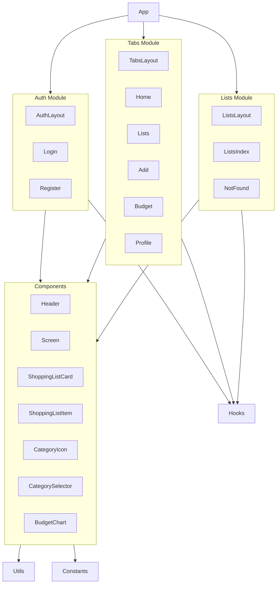
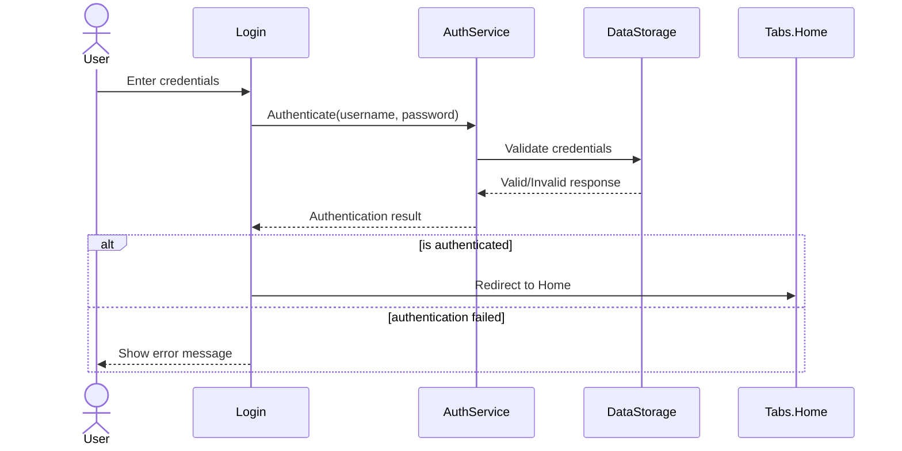
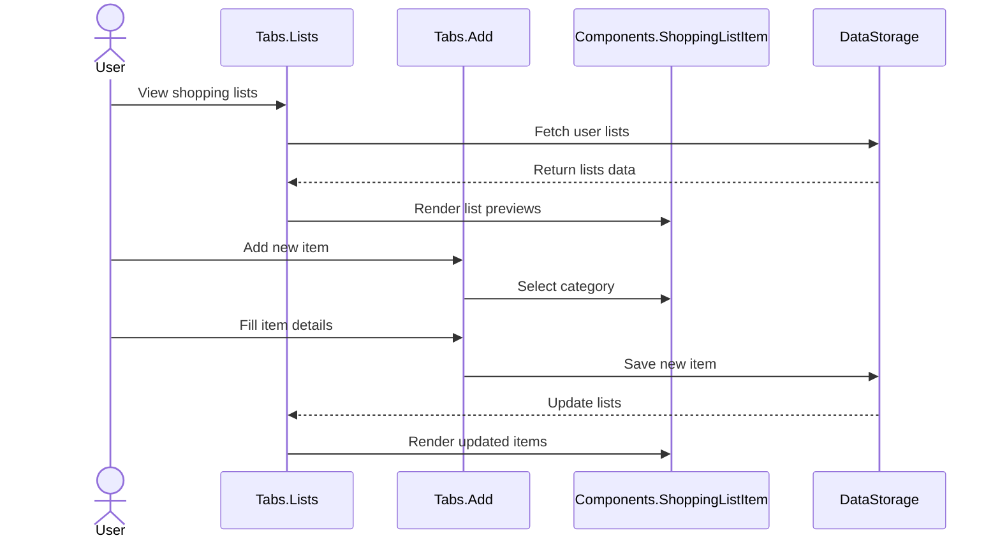
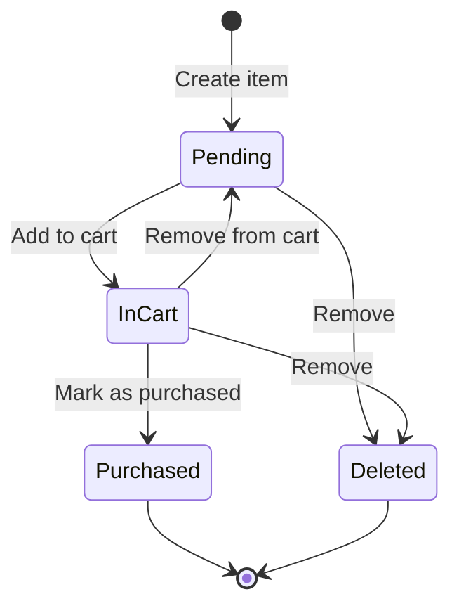
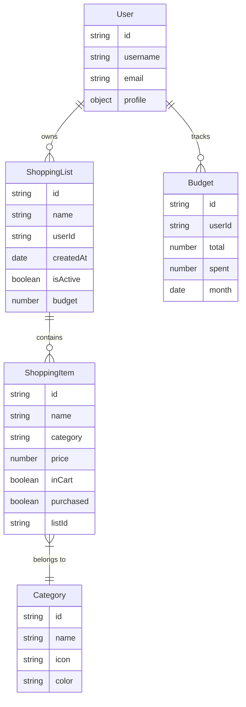
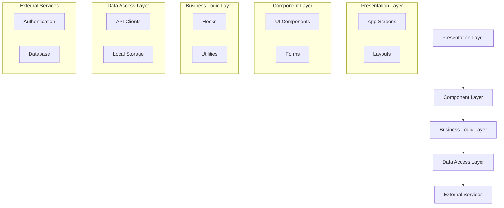

# ShoppList Application Architecture

## Component Diagram

## Sequence Diagram (Authentication Flow)

## Sequence Diagram (Shopping List Flow)

## State Diagram (Shopping List Item)

## Entity Relationship Diagram

## Application Layers

